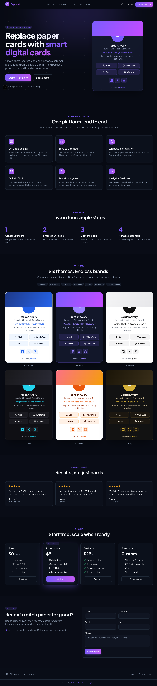

<div align="center">

# Tapcard — Digital Business Cards + CRM

[](https://nextjs.org)
[](https://react.dev)
[](https://www.typescriptlang.org)
[](https://tailwindcss.com)
[](https://www.prisma.io)
[](https://www.postgresql.org)
[](https://authjs.dev)
[](https://www.anthropic.com)
[](https://www.docker.com)
[](https://apps.apple.com/us/app/tertiary-tapcard/id6780261599)

**Replace paper business cards with smart digital cards.**
Create, share, capture leads, and manage customer relationships — all in one platform.

[Download on the App Store](https://apps.apple.com/us/app/tertiary-tapcard/id6780261599) · [Report Bug](https://github.com/alfredang/tapcard/issues) · [Request Feature](https://github.com/alfredang/tapcard/issues)

</div>

---

## Screenshot



---

## About

**Tapcard** is a modern, mobile-first digital business card platform with an integrated CRM — a
production-ready alternative to Blinq and CLDY. Its core promise: **publish a professional digital
business card in under two minutes**, then turn every introduction into a tracked, nurtured
relationship.

### Key features

|     | Feature              | Description                                                                                                              |
| --- | -------------------- | ------------------------------------------------------------------------------------------------------------------------ |
| 🪪  | **Card Builder**     | Canva-style 3-panel editor (content · live preview · design) with instant preview, autosave, 6 themes and accent colors. |
| 🌐  | **Public cards**     | Themed, mobile-first card pages at `/c/<slug>` with Save-Contact, Call, WhatsApp, Email, Website and social links.       |
| 📱  | **QR codes**         | Open card / save contact / WhatsApp / email / website, with color customization and PNG / SVG export.                    |
| 📇  | **Save to Contacts** | One-tap vCard (VCF) export compatible with iPhone, Android, Google and Outlook.                                          |
| 💬  | **WhatsApp**         | Message, request-a-quote and share deep links built in.                                                                  |
| 🎯  | **Lead capture**     | Visitors leave their details straight from your card — leads flow into the CRM.                                          |
| 📊  | **CRM**              | Contacts (CRUD, search, CSV export), leads inbox, and a drag-and-drop Kanban sales pipeline (7 stages).                  |
| 🍎  | **iOS app**          | Tertiary Tapcard is available on the App Store for iPhone users.                                                         |
| 🤖  | **AI**               | Bio / about generation and lead scoring via the **Claude Agent SDK** (subscription — no API key).                        |
| 📈  | **Analytics**        | Card views, QR scans, downloads and click tracking with an engagement dashboard.                                         |
| 🔐  | **Auth**             | Email + password, email OTP, and Google / Microsoft / LinkedIn SSO (auto-enabled when configured).                       |

---

## iOS App

Tertiary Tapcard is now available on the App Store:

[Download Tertiary Tapcard on the App Store](https://apps.apple.com/us/app/tertiary-tapcard/id6780261599)

---

## Tech Stack

| Category               | Technologies                                                                  |
| ---------------------- | ----------------------------------------------------------------------------- |
| **Frontend**           | Next.js 16 (App Router), React 19, TypeScript, Tailwind CSS v4, Framer Motion |
| **Forms & Validation** | React Hook Form, Zod                                                          |
| **Backend**            | Next.js Route Handlers, Prisma ORM                                            |
| **Database**           | PostgreSQL 16                                                                 |
| **Auth**               | Auth.js (NextAuth v5) — credentials, OTP, OAuth                               |
| **AI / LLM**           | Claude Agent SDK (`@anthropic-ai/claude-agent-sdk`) — subscription auth       |
| **UI / Interaction**   | dnd-kit (Kanban), qrcode, lucide-react                                        |
| **Deployment**         | Docker, Coolify, Vercel-compatible                                            |

---

## Architecture

```
                          ┌─────────────────────────────────────────────┐
                          │                Visitors                      │
                          │   Public card  /c/<slug>  ·  QR  ·  VCF       │
                          └───────────────┬─────────────────────────────┘
                                          │ lead capture · analytics beacons
                                          ▼
┌──────────────┐   ┌──────────────────────────────────────────────────────────┐
│   Browser    │   │                  Next.js 16 (App Router)                   │
│  (Owner UI)  │──▶│                                                            │
│ Builder/CRM  │   │  (marketing)   (auth)   (app)            c/[slug]   api/   │
└──────────────┘   │   landing      login    dashboard        public    route  │
                   │                register  cards/builder    card      handlers
                   │                          crm · analytics                   │
                   └───────┬─────────────────────────┬───────────────┬─────────┘
                           │ Auth.js                  │ Prisma        │ Claude Agent SDK
                           ▼                          ▼               ▼ (subscription)
                   ┌──────────────┐          ┌─────────────────┐  ┌──────────────┐
                   │  Sessions /  │          │  PostgreSQL 16  │  │  Claude      │
                   │  OAuth / OTP │          │  (Prisma ORM)   │  │  (AI gen +   │
                   └──────────────┘          └─────────────────┘  │  lead score) │
                                                                   └──────────────┘
```

---

## Project Structure

```
tapcard/
├── prisma/
│   ├── schema.prisma          # full data model (cards, CRM, analytics, teams)
│   └── seed.ts                # demo account + sample data
├── src/
│   ├── app/
│   │   ├── (marketing)/       # landing page
│   │   ├── (auth)/            # login / register
│   │   ├── (app)/             # dashboard, cards, crm, analytics, settings
│   │   ├── c/[slug]/          # public card page
│   │   └── api/               # route handlers (cards, leads, deals, ai, …)
│   ├── components/            # ui · card · builder · crm · marketing · app
│   ├── lib/                   # db, ai, vcf, qr, whatsapp, themes, validators
│   └── auth.ts               # Auth.js configuration
├── docker-compose.yml         # Postgres (+ optional full-stack profile)
├── Dockerfile                 # standalone production image
└── README.md
```

---

## Getting Started

### Prerequisites

- Node.js 22+
- Docker (for local Postgres) — or your own `DATABASE_URL`

### Installation

```bash
# 1. Clone
git clone https://github.com/alfredang/tapcard.git
cd tapcard

# 2. Install
npm install
cp .env.example .env          # set AUTH_SECRET: openssl rand -base64 32

# 3. Start the database (Postgres on host port 5434)
docker compose up -d db

# 4. Migrate + seed demo data
npm run setup

# 5. Run
npm run dev
```

Open **http://localhost:3000**

|                      |                                      |
| -------------------- | ------------------------------------ |
| **Demo login**       | `demo@tapcard.app` / `password123`   |
| **Demo public card** | http://localhost:3000/c/jordan-avery |

> Email OTP codes are printed to the **server console** in dev (no email server required).

### AI (Claude Agent SDK — subscription, not an API key)

AI features run through `@anthropic-ai/claude-agent-sdk`, which uses your **Claude subscription**
via the logged-in Claude credentials — **never an `ANTHROPIC_API_KEY`**.

- **Local dev:** if you're logged into Claude Code, it just works.
- **Headless / production:** run `claude setup-token` and set `CLAUDE_CODE_OAUTH_TOKEN`. The `claude`
  CLI must be present in the runtime (see the commented line in the `Dockerfile`).
- **No credential?** Every AI feature **degrades gracefully** to a sensible templated result.

---

## Deployment

### Docker (full stack)

```bash
AUTH_SECRET=$(openssl rand -base64 32) docker compose --profile full up --build
```

Runs Postgres + the app (Next.js standalone output) together.

### Coolify / Vercel

- **Coolify:** point it at this repo; it builds the `Dockerfile`. Provision a PostgreSQL resource and
  set `DATABASE_URL`, `AUTH_SECRET`, `NEXT_PUBLIC_APP_URL`. Run `npx prisma migrate deploy` as a
  post-deploy/release command.
- **Vercel:** compatible (standalone build). Add a hosted Postgres (Neon/Supabase), set the env vars,
  and add `prisma migrate deploy` to the build.

### Environment variables

See [`.env.example`](./.env.example). Key ones: `DATABASE_URL`, `AUTH_SECRET`, `NEXT_PUBLIC_APP_URL`,
the optional `GOOGLE_/MICROSOFT_/LINKEDIN_CLIENT_ID/SECRET`, and `CLAUDE_CODE_OAUTH_TOKEN`.

---

## Scripts

| Script               | Description                          |
| -------------------- | ------------------------------------ |
| `npm run dev`        | Start the dev server                 |
| `npm run build`      | `prisma generate` + production build |
| `npm run setup`      | Migrate + seed                       |
| `npm run db:migrate` | Create/apply a migration             |
| `npm run db:seed`    | Seed demo data                       |
| `npm run db:studio`  | Open Prisma Studio                   |
| `npm run format`     | Prettier                             |

---

## Contributing

Contributions are welcome!

1. Fork the repository
2. Create a feature branch: `git checkout -b feature/amazing-feature`
3. Commit your changes: `git commit -m "feat: add amazing feature"`
4. Push the branch: `git push origin feature/amazing-feature`
5. Open a Pull Request

For questions and ideas, open an [issue](https://github.com/alfredang/tapcard/issues).

---

## Developed By

**[Tertiary Infotech Academy Pte Ltd](https://www.tertiaryinfotech.com/)**

---

## Acknowledgements

- [Next.js](https://nextjs.org) · [Prisma](https://www.prisma.io) · [Auth.js](https://authjs.dev) · [Tailwind CSS](https://tailwindcss.com)
- [Anthropic Claude](https://www.anthropic.com) via the Claude Agent SDK
- [dnd-kit](https://dndkit.com), [lucide](https://lucide.dev), [qrcode](https://github.com/soldair/node-qrcode)
- Inspired by [Blinq](https://blinq.me) and [CLDY](https://manage.cldy.com)

---

<div align="center">

⭐ If you find this useful, please star the repo!

Built as a modern alternative to Blinq and CLDY — focused on simplicity, speed, mobile usability,
lead generation, and CRM.

</div>
